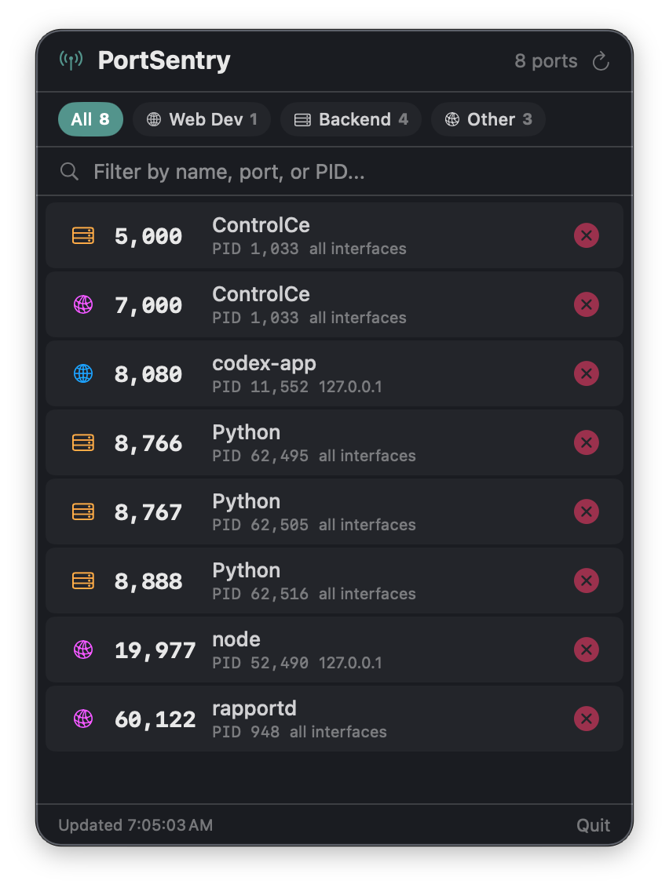

# PortSentry

A native macOS menu bar app that shows all listening TCP ports and lets you kill stuck processes with one click.



## Why

Every developer hits "EADDRINUSE: address already in use" multiple times a week. The fix is always the same: find the PID with `lsof`, then `kill` it. PortSentry puts that workflow in your menu bar — glanceable port list, one-click kill, done.

## Features

- **Menu bar icon** with live port count (antenna icon, changes to slash when no ports)
- **Color-coded categories**: Web Dev (blue), Backend (orange), Database (green), System (gray), Other (purple)
- **Filterable port list**: search by process name, port number, or PID
- **Category chips**: quick-filter to Web Dev, Backend, Database, etc.
- **One-click kill** with confirmation dialog
- **Graceful shutdown**: sends SIGTERM first, waits 500ms, then SIGKILL if still running
- **Kill result banner**: success/failure feedback with auto-dismiss
- **Auto-refresh** every 5 seconds
- **Dark theme** consistent with modern macOS apps
- **No dock icon** — lives entirely in the menu bar

## Install

**Using the build script (recommended):**

```bash
cd PortSentry
chmod +x build.sh
./build.sh
open PortSentry.app
```

**Or compile manually:**

```bash
cd PortSentry
swiftc -parse-as-library -o PortSentry PortSentry.swift
./PortSentry
```

**Or build a .app bundle manually (no dock icon):**

```bash
cd PortSentry
swiftc -parse-as-library -o PortSentry PortSentry.swift
mkdir -p PortSentry.app/Contents/MacOS
cp PortSentry PortSentry.app/Contents/MacOS/
cp Info.plist PortSentry.app/Contents/
open PortSentry.app
```

## Quickstart

1. Launch PortSentry — antenna icon appears in menu bar with port count
2. Click the icon — see all listening TCP ports grouped by category
3. Use the search bar to filter by name, port, or PID
4. Click the red X button on any port to kill the process
5. Confirm the kill in the dialog — PortSentry sends SIGTERM then SIGKILL

## Port Categories

| Category | Ports | Icon |
|----------|-------|------|
| Web Dev | 80, 443, 3000-3999, 4200, 5173-5174, 5500, 8080-8089 | globe |
| Backend | 4000-4999, 5000-5100, 8000-8079, 8090-8999, 9000-9999 | server.rack |
| Database | 3306, 5432-5433, 6379-6380, 27017-27018, 9200, 11211, 2379 | cylinder |
| System | 0-1023 | gearshape |
| Other | Everything else | network |

## Examples

**Kill a stuck dev server:**
You ran `npm start` on port 3000 an hour ago and forgot about it. Now `EADDRINUSE` blocks your new session. Click the PortSentry icon, find port 3000 under "Web Dev" (blue), click the red X, confirm the kill. The port is free in under a second.

**Find what is using port 5432:**
Click the PortSentry icon and look under the "Database" category (green). Port 5432 shows "postgres" with its PID. Hover to see the full command path.

**Filter by category:**
Click a category chip (e.g., "Backend") to show only backend ports (4000-4999, 5000-5100, 8000-8999, 9000-9999). Click it again to clear the filter.

**Search for a specific port:**
Type "8080" into the search bar. Only processes listening on port 8080 appear, regardless of category.

**Audit all listening ports:**
Click the PortSentry icon to see every TCP port in LISTEN state on your machine. The count in the menu bar (e.g., "12") tells you at a glance how many ports are open.

## How it works

PortSentry runs `/usr/sbin/lsof -iTCP -sTCP:LISTEN -n -P` to discover listening ports. It parses the output to extract port numbers, PIDs, process names, and bind addresses. The scan runs every 5 seconds.

Kill uses POSIX `kill()` directly — SIGTERM first for graceful shutdown, then SIGKILL after 500ms if the process doesn't exit.

## Testing

PortSentry has no automated test suite (single-file SwiftUI app). Verify correctness manually:

1. **Compile check** -- `swiftc -parse-as-library -o PortSentry PortSentry.swift` should complete with zero errors and zero warnings.
2. **Launch check** -- run `./PortSentry` or `open PortSentry.app`. An antenna icon with a port count should appear in the menu bar.
3. **Port listing** -- click the menu bar icon. All listening TCP ports should appear, grouped by category with colored icons.
4. **Start a test server** -- run `python3 -m http.server 8080` in Terminal. Within 5 seconds, port 8080 should appear in the PortSentry popup under "Web Dev".
5. **Search** -- type "8080" in the search bar. Only the matching entry should appear. Clear the search and all ports return.
6. **Category filter** -- click a category chip (e.g., "Web Dev"). Only ports in that category should show. Click again to clear.
7. **Kill process** -- click the red X next to the test server entry. Confirm in the dialog. The kill result banner should show success, and the port should disappear on the next scan.
8. **Verify kill** -- run `lsof -iTCP:8080 -sTCP:LISTEN` in Terminal. It should return no results.
9. **Graceful shutdown** -- the kill sends SIGTERM first, then SIGKILL after 500ms. Test with a process that traps SIGTERM to verify the two-stage behavior.
10. **Background-only** -- verify no dock icon appears. On macOS, run: `osascript -e 'tell application "System Events" to get name of every process whose background only is true'` and confirm PortSentry is in the list.

## Requirements

- macOS 14.0+ (Sonoma or later)
- Swift 6.0+ compiler
- `/usr/sbin/lsof` must be accessible (present by default on macOS)

## Troubleshooting

- **"No listening ports"** -- If nothing appears, check that `lsof` is accessible. Run `lsof -iTCP -sTCP:LISTEN` in Terminal to verify.
- **Kill failed** -- Some system processes require elevated privileges. Run PortSentry with `sudo` if needed (not recommended for daily use).
- **Menu bar icon not updating** -- The icon updates on scan cycles. Click refresh or wait 5 seconds.
- **Port count seems high** -- PortSentry shows all TCP listeners, including system services. Use category filters to focus on development ports.

## License

MIT
